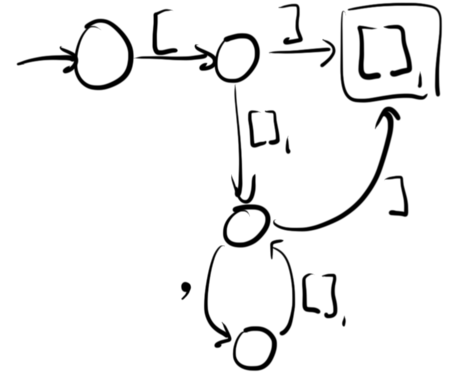

Owl is a parser generator which targets the class of [visibly pushdown languages](https://en.wikipedia.org/wiki/Nested_word).  It is:

* Efficient — parsers generated by Owl always run in linear time.
* Understandable — like regular expressions, its parsing model (and error messages<sup><a name="footnote1up" href="#footnote1">[1]</a></sup>) can be understood without talking about parser states, backtracking, lookahead, or any other implementation details.
* Easy to use — using Owl's interpreter mode, you can design, test, and debug your grammar without writing any code.  An Owl grammar compiles to a single C header file which provides a straightforward parse tree API.

Here's a grammar for a simple programming language with expressions, assignment, and a `print` statement ([see it online with syntax highlighting](https://ianh.github.io/owl/try/#example)).

```
program = stmt*
stmt =
   'print' expr : print
   identifier '=' expr : assign
expr =
   [ '(' expr ')' ] : parens
   identifier : variable
   number : literal
 .operators prefix
   '-' : negative
 .operators infix left
   '*' : times
   '/' : divided-by
 .operators infix left
   '+' : plus
   '-' : minus
```

More examples are available in the [example/](example/) directory.

## how to use it

You can build the `owl` tool from this repository using `make`:

```console
$ git clone https://github.com/ianh/owl.git
$ cd owl/
$ make
```

Run `make install` to copy the `owl` tool into `/usr/local/bin/owl`.

On Windows, [MSYS2](http://www.msys2.org/) is the supported way to build `owl`.  In the MSYS shell, run `pacman -S make gcc git` to install the proper dependencies before running the commands above.  To install, use `make PREFIX=/usr install` (which copies to `/usr/bin/owl` instead).

Owl has two modes of operation&mdash;**interpreter mode** and **compilation mode**.

In **interpreter mode**, Owl reads your grammar file, then parses standard input on the fly, producing a visual representation of the parse tree as soon as you hit `^D`:

```console
$ owl test/expr.owl
1 + 2
^D
. 1            + 2
  expr:literal   expr:literal
  expr:plus------------------
```

You can specify a file to use as input with `--input` or `-i`:

```console
$ echo "8 * 7" > multiply.txt
$ owl test/expr.owl -i multiply.txt
. 8            * 7
  expr:literal   expr:literal
  expr:times-----------------
```

You can also use Owl's interpreter [on the web](https://ianh.github.io/owl/try/).

In **compilation mode**, Owl reads your grammar file, but doesn't parse any input right away.  Instead, it generates C code with functions that let you parse the input later.

```console
$ owl -c test/expr.owl -o parser.h
```

You can `#include` this generated parser into a C program:

```C
#include "parser.h"
```

Wherever you #define `OWL_PARSER_IMPLEMENTATION`, the implementation of the parser will also be included.  Make sure to do this somewhere in your program:

```C
#define OWL_PARSER_IMPLEMENTATION
#include "parser.h"
```

For more about how to use this header, see the docs on [using the generated parser](doc/generated-parser.md).

## rules and grammars

Rules in owl are written like regular expressions with a few extra features.  Here's a rule that matches a comma-separated list of numbers:

```
number-list = number (',' number)*
```

Note that Owl operates on tokens (like `','` and `number`), not individual characters like a regular expression would.  Owl comes with the built-in token classes `number`, `identifier`, `integer`, and `string`; keywords `'like'` `'this'` match their literal text.

To create a parse tree, you can write rules that refer to each other:

```
variable = 'var' identifier (':' type)?
type = 'int' | 'string'
```

Rules can only refer to later rules, not earlier ones: plain recursion isn't allowed.  Only two restricted kinds of recursion are available: *guarded recursion* and *expression recursion*.

*Guarded recursion* is recursion inside `[ guard brackets ]`.  Here's a grammar to parse `{"arrays", "that", {"look", "like"}, "this"}`:

```
element = array | string
array = [ '{' element (',' element)* '}' ]
```

The symbols just inside the brackets — `'{'` and `'}'` here — are the *begin* and *end tokens* of the guard bracket.  Begin and end tokens can't appear anywhere else in the grammar except as other begin and end tokens.  This is what guarantees the language is *visibly pushdown*: all recursion is explicitly delineated by special symbols.

*Expression recursion* lets you define unary and binary operators using the `.operators` keyword:

```
expression =
    identifier | number | parens : value
  .operators prefix
    '-' : negate
  .operators infix left
    '+' : add
    '-' : subtract
parens = [ '(' expression ')' ]
```

Operators in the same `.operators` clause have the same precedence level; clauses nearer the top of the list are higher in precedence.

These forms of recursion may seem limiting, but you can go surprisingly far with them.  For example, if you're willing to use `?` and `:` as begin and end tokens, the C ternary operator can be written as an infix operator:

```
expr =
    ...
  .operators infix left
    [ '?' middle ':' ] : ternary
```

For a more thorough guide to Owl's grammar format, check out the [grammar reference](doc/grammar-reference.md).  The [example/](example/) directory also has some example grammars.

## what owl isn't

### non-goals

* Parsing arbitrary context-free languages or other, more general languages.
* Constant-space streaming-style parsing — the way Owl parses operators depends on having a syntax tree representation (plus, see the "memory use" bullet below).

### current limitations

* Large grammars — Owl uses precomputed DFAs and action tables, which can blow up in size as grammars get more complex.  In the future, it would be nice to build the DFAs incrementally.
* Memory use — generated parsers store a small (single digit bytes) amount of information for every token while parsing in order to resolve nondeterminism.  If a decision about what to match depends on a token which appears much later in the text, the parser needs to store enough information to go back and make this decision at the point that the token appears.  Instead of analyzing how long to wait before making these decisions, it just waits until the end, gathering data for the entire input before creating the parse tree.
* Error messages — generated parsers can show you the token where an error happened<sup><a name="footnote2up" href="#footnote2">[2]</a></sup>, but they can't suggest how to fix it.
* Generating code in other languages — only C is supported right now.

## footnotes

<a name="footnote1">[1]</a> This includes errors caused by ambiguities, where your grammar can match the same text in two different ways.  Owl shows you the text in question alongside its two conflicting matches:

```
error: this grammar is ambiguous

. a ( b ) 

  can be parsed in two different ways: as

. a ( b )   
  expr:call 
  stmt:expr 
  program-- 

  or as

. a          ( b )       
  expr:ident expr:parens 
  stmt:expr- stmt:expr-- 
  program--------------- 
```

If you want more context for why this is important, [LL and LR in Context: Why Parsing Tools Are Hard](http://blog.reverberate.org/2013/09/ll-and-lr-in-context-why-parsing-tools.html) is a good summary.  Ambiguity is an inherent problem with context-free grammars; limiting ourselves to visibly pushdown languages lets us solve this problem (at the expense of excluding some useful grammars).

[**go back up**](#footnote1up)

. . . . . . .

<a name="footnote2">[2]</a> To be precise, the parser reports the token where the input stopped being a valid prefix of the grammar.  It's possible that the "real" error location was earlier in the input.

[**go back up**](#footnote2up)

## notes and bibliography

This article about Rust's macro system was what got me thinking about all of this in the first place:

- Daniel Keep. 2017. [A Practical Intro to Macros in Rust 1.0](https://danielkeep.github.io/practical-intro-to-macros.html).

The question I had was: what would a parser that operated directly on token trees look like?  In particular, could you just use regular expressions to parse each level of the tree?

### visibly pushdown languages

It turns out there's a [body of research](http://madhu.cs.illinois.edu/vpa/) which answers this question.  Combining an ordinary regular language with explicit nesting tokens gives you what's called a visibly pushdown language (or VPL):

- Rajeev Alur and P. Madhusudan. 2004. [Visibly Pushdown Languages](http://madhu.cs.illinois.edu/stoc04.pdf). [[doi](https://doi.org/10.1145/1007352.1007390)]

or, as it has been called earlier, an input-driven pushdown language:

- Kurt Mehlhorn. 1980. [Pebbling Mountain Ranges and its Application to DCFL-Recognition](https://pdfs.semanticscholar.org/1c9b/c1ae6b2484b236bf9d674b8d10bdaad95eb1.pdf). [[doi](https://dx.doi.org/10.1007/3-540-10003-2_89)]

These languages share a lot of nice properties with regular languages, including closure under union and concatenation (which are useful for composing VPL/IDPLs out of atomic pieces).

VPLs are often used for program analysis, where the nesting tokens represent calls and returns in an execution trace.  There haven't been many attempts to apply this theory to text parsing, though.  This presentation about visibly pushdown applicative parser combinators in Haskell is the only one I've found:

- Philippa Cowderoy. 2011. [Visibly Powerful Parsing](http://www.flippac.org/talks/VPParsing.pdf).

### automata

To match (balanced) visibly pushdown languages, Owl uses a pair of finite-state automata—a "base automaton" and a "bracket automaton"—with a few rules for moving between them.  I'll describe how these automata work briefly.

The idea is to treat an entire bracketed group of tokens `( ... )` as a single *bracket symbol*.  The bracket automaton matches these groups, and the bracket automaton's accepting state tells us the bracket symbol.

Each symbol is classified as one of the following:

* the **begin symbols** (<sub>1</sub> … (<sub>*m*</sub> — "begin tokens" that appear on the left side of a guard bracket
* the **end symbols** )<sub>1</sub> … )<sub>*n*</sub> — "end tokens" that appear on the right side of a guard bracket
* the **regular symbols** *a*<sub>1</sub> … *a*<sub>*l*</sub> — all tokens except the begin and end tokens
* the **bracket symbols** ()<sub>1</sub> … ()<sub>*k*</sub> — these don't appear in the input, but are produced by matching against the bracket automaton.

Execution starts at the start state of the base automaton.  A stack of states is used during execution; it's initialized to be empty.  The automaton reads each symbol from the input and acts according to its classification:

* a regular symbol
    * transitions normally;
* a begin symbol
    * pushes the current state onto the stack,
    * moves to the start state of the bracket automaton,
    * and transitions normally from that start state;
* an end symbol
    * transitions normally,
    * checks the bracket symbol corresponding to the current accepting bracket automaton state,
    * pops the current state from the stack,
    * and transitions normally from the popped state using that bracket symbol.

A sequence of input symbols is recognized if this process leaves us in an accepting state of the base automaton.

Here's a quick drawing of what the two automata look like for this [grammar of nested arrays](https://ianh.github.io/owl/try/#nested): `a = [ '[' (a (',' a)*)? ']' ]`.

|  |  |
| :---: | :---: |
| *base automaton* | *bracket automaton* |


The square-shaped state is the labeled accepting state of the bracket automaton.

### determinization

[Owl's determinization](src/5-determinize.c) is an iterative version of the usual [subset construction](https://en.wikipedia.org/wiki/Powerset_construction).  The first iteration ignores the bracket symbols, following only transitions involving regular, begin, and end symbols.  Once accepting state sets appear in the determinized bracket automaton, the bracket symbols corresponding to the states in each set are followed simultaneously (since their appearance in a state set means they can occur together) during the next iteration of the subset construction.

Because these accepting state sets grow monotonically (we only ever find new ways of reaching them) and are bounded above in size, this iterative process eventually stops making progress.  At this point, determinization is finished, and the accepting state sets in the bracket automaton become the new bracket symbols in the deterministic automata.

### parse tree construction

The next step is to generate a parse tree.  When Owl builds its automata from a grammar, it encodes [parse tree actions](src/construct-actions.h) (like "start operand", "set slot choice", etc.) along certain transitions.  How can Owl preserve this information during determinization so it can reconstruct the list of actions?

These two papers describe how to do that:

- Danny Dubé and Marc Feeley. 2000. [Efficiently building a parse tree from a regular expression](http://www.iro.umontreal.ca/~feeley/papers/DubeFeeleyACTAINFORMATICA00.pdf). [[doi](http://dx.doi.org/10.1007/s002360000037)]
- Danny Dubé and Anass Kadiri. 2006. [Automatic construction of parse trees for lexemes](http://www.schemeworkshop.org/2006/14-dube.pdf).

The basic idea is: each transition in the deterministic automaton is derived from several transitions in the original automaton (typically with the same symbol).  Collect the original transitions which produce each deterministic transition together in a table.

Then, when you find a path through the deterministic automaton, start from the end and walk backward along the path, using the table for each transition to reconstruct the original path through the original automaton.

Adapting this technique to Owl's iterative determinization algorithm is straightfoward: since determinized bracket symbols can represent multiple non-deterministic symbols, the table has an extra field for the non-deterministic symbol, but everything else is the same.

I considered some other approaches too:

A Thompson-style interpreter would sidestep the problem by interpreting the original, non-deterministic automaton.

- Russ Cox. 2009. [Regular Expression Matching: the Virtual Machine Approach](https://swtch.com/~rsc/regexp/regexp2.html).

Each thread would have to store its own action list, which could end up taking a lot of memory for some inputs—that's why I avoided this approach in the first place.  But the Dubé-Feeley-style action maps also take up a lot of memory.  In retrospect, I think this approach could be worth a try.

Laurikari's tagged NFAs seem like they would work well for a limited number of sub-matches, but I couldn't think of a way to scale them up to a full parse tree:

- Ville Laurikari. 2000. [NFAs with Tagged Transitions, their Conversion to Deterministic Automata and Application to Regular Expressions](https://laurikari.net/ville/spire2000-tnfa.pdf). [[doi](https://doi.org/10.1109/SPIRE.2000.878194)]
- Ville Laurikari. 2001. [Efficient Submatch Addressing for Regular Expressions](http://citeseerx.ist.psu.edu/viewdoc/summary?doi=10.1.1.23.6717).

### operator-precedence grammars

A variation of Dijkstra's two-stack "shunting-yard" algorithm is used to associate operators with their operands (see [src/x-construct-parse-tree.h](src/x-construct-parse-tree.h) for the implementation).  I mostly just read the [Wikipedia page](https://en.wikipedia.org/wiki/Shunting-yard_algorithm) for this one, though the original reference is apparently:

- E.W. Dijkstra. 1961. [An Algol 60 Translator for the X1](http://www.cs.utexas.edu/~EWD/MCReps/MR35.PDF).

### ambiguity checking

In order to check the grammar for ambiguity, Owl creates a "product automaton" over pairs of states—a path through the product automaton corresponds to two paths in the original automaton that accept the same input.  This paper was very helpful when I was figuring out how to search the product automaton for ambiguity in a systematic way:

- Cyril Allauzen, Mehryar Mohri, and Ashish Rastogi. 2011. [General Algorithms for Testing the Ambiguity of Finite Automata and the Double-Tape Ambiguity of Finite-State Transducers](https://research.google.com/pubs/archive/37168.pdf). [[doi](http://doi.org/10.1142/S0129054111008477)]

Owl uses a variation of their "epsilon filtering" technique to create the product automaton without introducing bogus ambiguities.

### parse tree formatting

The way that Owl's interpreter and ambiguity checker display parse trees was inspired by the icicle plot visualization in [Ohm](https://nextjournal.com/dubroy/ohm-parsing-made-easy) (a PEG parser):

- Patrick Dubroy, Saketh Kasibatla, Meixian Li, Marko Röder, and Alex Warth. 2016. [Language Hacking in a Live Programming Environment](https://ohmlang.github.io/pubs/live2016/).

Owl turns the icicles upside down (a stalagmite plot?) on the principle that the text itself forms the leaves of the tree.

. . . . . . .

*Ian Henderson <<ian@ianhenderson.org>><br>
(Feel free to email me with any questions or comments!)*
